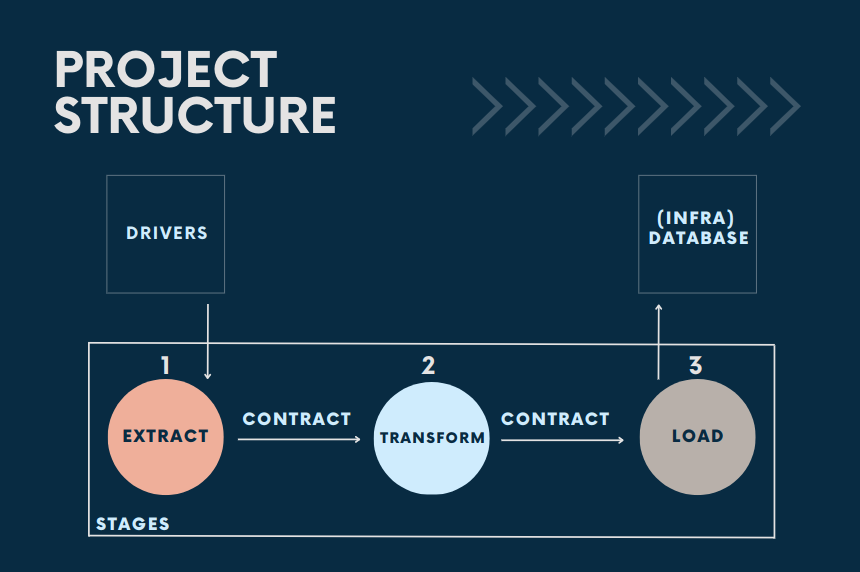

# ETL

## O que é?

Extração, transformação e carregamento (ETL) correspondem ao processo de combinação de dados de várias fontes em um grande repositório central. O processo de ETL usa um conjunto de regras de negócios para limpar e organizar dados brutos e prepará-los para armazenamento, análise de dados e machine learning (ML).

### <strong>Importância do ETL</strong>

Atualmente, as organizações têm dados estruturados e não estruturados de várias fontes. Com a aplicação do processo de extração, transformação e carregamento (ETL), conjuntos de dados brutos individuais podem ser preparados em um formato e uma estrutura mais consumíveis para fins de análise, resultando em informações mais significativas.

referência: https://aws.amazon.com/pt/what-is/etl/


# Projeto

A ideia foi fazer um webscrapping em uma página web (extract), transformar (transform) esses dados para pegar determinadas iformações e salva (load) em um Banco de dados MySQL.

## Estrutura

Engloba conceitos de Clean Architecture e Clean Coding.

### src

- drivers: Pasta que guarda os métodos de request e suas interfaces.
- erros: Tratamento de erros
- infra: Banco de dados
- stages: Estágios do ETL
- main: classe principal que agrupa o ETL

### Como rodar o projeto
Na raiz do projeto rode
```
python3 run.py
```
Obs: Precisa subir o container do banco de dados como descrito abaixo.

## Database
Para subir o banco de dados MySQL basta dar o build no Dockerfile que
automaticamente ele criará o banco de dados e executará o arquivo `docker/db/db.sql`

## Testing
```sh
python3 -m pytest
```

## Compute test coverage
```sh
python3 -m pytest --cov
```